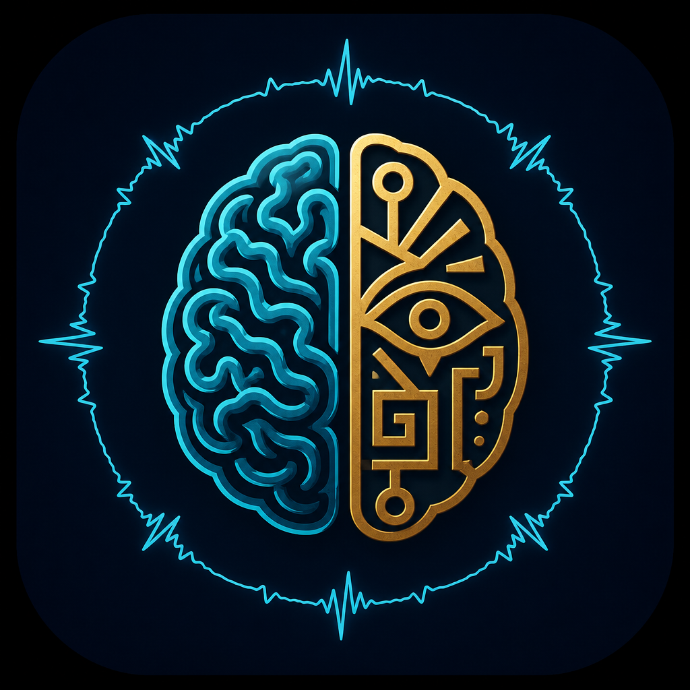
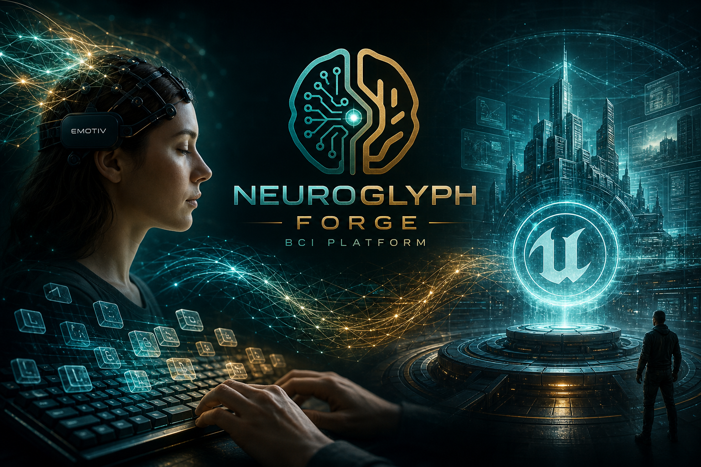
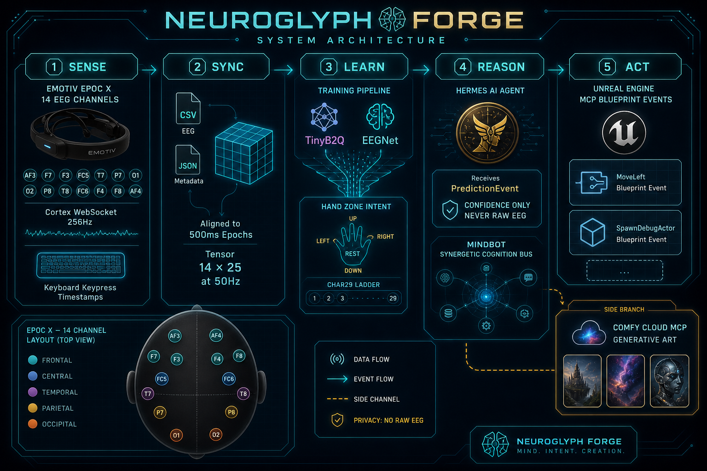

<p align="center">
  
</p>

<h1 align="center">NeuroGlyph Forge</h1>

<p align="center">
  <strong>EPOC X → keystroke-aligned EEG decoder → Hermes Agent → Unreal Engine MCP</strong>
</p>

<p align="center">
  Brain2Qwerty-inspired BCI stack for <b>14-channel EMOTIV EPOC X</b> — not compatible with Meta lab EEG checkpoints.
</p>

<p align="center">
  
</p>

<p align="center">
  
</p>

---

## What it is

**NeuroGlyph Forge** is an open research-to-demo pipeline for *mind-linked typing and intent control*:

1. **Record** raw EEG (Cortex Premium) + keyboard timestamps  
2. **Train** `TinyB2Q` / `EEGNet` on aligned 500 ms epochs (14×25 @ 50 Hz)  
3. **Decode** live with confidence gates  
4. **Reason** in [Hermes Agent](https://github.com/NousResearch/hermes-agent) (MCP tools)  
5. **Act** in Unreal via editor MCP (`MoveLeft`, `SpawnDebugActor`, …)

Part of the broader **MindBot / synergetic cognition** story — this repo is the **sensory-motor slice** (see `docs/MINDBOT_INTEGRATION.md`).

## MVP

> **Hand / zone / intent from EEG → Hermes → Unreal scene action.**

Progressive tasks: `hand` → `zone` → `char29` / `intent`.

## Quick start

```bash
git clone https://github.com/TheMindExpansionNetwork/neuroglyph-forge.git
cd neuroglyph-forge
python -m venv .venv
source .venv/Scripts/activate   # Windows Git Bash
pip install -e .
pytest tests/ -q
bash scripts/pipeline.sh hand
python scripts/live_bci_demo.py --seconds 3
```

Live headset: `docs/CORTEX_SETUP.md` · Unreal: `docs/UNREAL_SETUP.md` · Architecture: `docs/SYSTEM.md` · **Brain map:** `docs/BRAINMAP.md` · [interactive HTML](docs/brainmap.html)

## Repository layout

| Path | Role |
|------|------|
| `neuroglyph_recorder/` | Cortex JSON-RPC client, keylogger, session CSV |
| `neuroglyph_data/` | Epochs, EMOTIV CSV import, synthetic CI data |
| `neuroglyph_models/` | TinyB2Q, EEGNet, task heads |
| `neuroglyph_train/` | Train, eval, finetune, TorchScript export |
| `neuroglyph_agent/` | Hermes MCP tools + live decoder |
| `neuroglyph_unreal/` | Prediction → UE blueprint events |
| `scripts/` | `pipeline.sh`, `live_bci_demo.py`, `collect_session.py` |

## Hermes MCP

**In-repo stdio server** (train, preprocess, Unreal bridge):

```yaml
# ~/.hermes/config.yaml — snippet in configs/hermes-mcp-snippet.yaml
mcp_servers:
  neuroglyph:
    command: "D:/neuroglyph-forge/.venv/Scripts/python.exe"
    args: ["-m", "neuroglyph_agent.hermes_stdio_mcp"]
```

**Comfy Cloud** (promo art, generative workflows): `docs/COMFY_MCP.md` — [Comfy Cloud MCP](https://docs.comfy.org/agent-tools/cloud).

```bash
hermes mcp test comfy-cloud   # expects X-API-Key header
```

## Datasets

| Source | Use |
|--------|-----|
| [SpanishBCBL](https://huggingface.co/datasets/bcbl190626/SpanishBCBL) | Pipeline / CER reference only |
| **NeuroGlyph-EPOC-Typing-v1** (you record) | Required for real accuracy |

## Brand assets

Regenerate with OpenAI **`gpt-image-2`** (fallback `gpt-image-1.5` / `gpt-image-1`):

```bash
python scripts/generate_brand_assets.py --all
python scripts/generate_brand_assets.py --brainmap
```

Outputs under `assets/brand/`. If OpenAI billing limit hits, use Hermes **`mcp_comfy_cloud_partner_generate`** with prompts in `assets/brand/manifest.json`.

## License

Independent implementation. Brain2Qwerty is [CC BY-NC 4.0](https://github.com/facebookresearch/brain2qwerty/blob/main/LICENSE); do not redistribute their weights with this repo.

## Credits

- Inspired by [brain2qwerty](https://github.com/facebookresearch/brain2qwerty)  
- Agent layer: [Hermes Agent](https://github.com/NousResearch/hermes-agent)  
- Visual promo: OpenAI Images API (`gpt-image-2`) + Comfy Cloud MCP