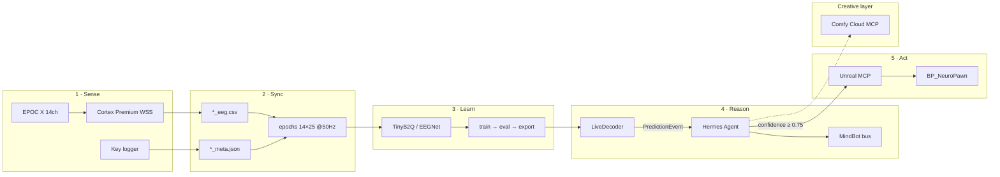

# NeuroGlyph Forge — brain map (system + MindBot)

Text + diagram spec for docs, white papers, and image generation prompts.

## Mermaid (renders on GitHub)



## EPOC X channel ring (top view)

Scalp positions for prompts / UI (approximate layout):

```
        AF3 ——— AF4
    F7   F3   F4   F8
      FC5       FC6
    T7           T8
    P7   O1 O2   P8
```

Channels: AF3, F7, F3, FC5, T7, P7, O1, O2, P8, T8, FC6, F4, F8, AF4.

## Progressive decode ladder

```
hand (2) → zone (8) → intent (8 verbs) → char29 (B2Q-style)
```

## MCP surfaces

| Server | Transport | Role |
|--------|-----------|------|
| `neuroglyph` | stdio | train, preprocess, Unreal bridge |
| `comfy-cloud` | HTTPS | promo art, generative workflows |
| `unreal-mcp` | HTTP | editor blueprint events |

## Image asset

Regenerate the visual brain map:

```bash
python scripts/generate_brand_assets.py --brainmap
```

Output: `assets/brand/brainmap-gpt-image-2.png`